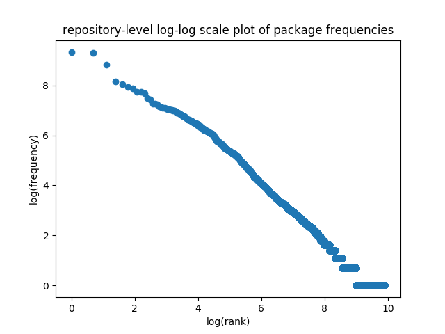
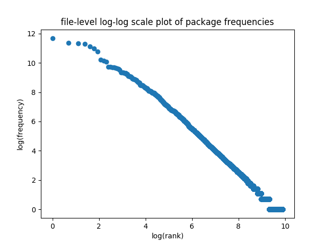
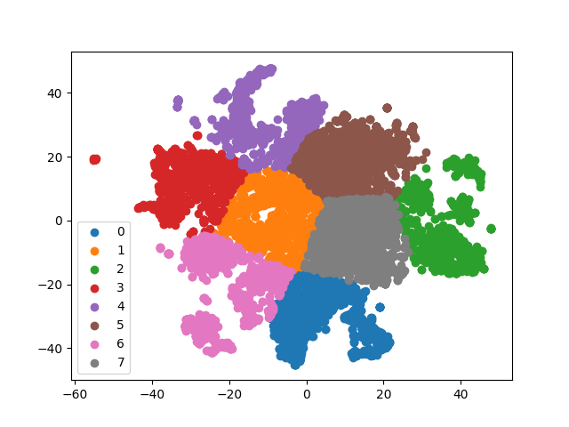

# Package Analysis Tool

This repository contains code to (i) acquire open source git repositories in a given domain, 
(ii) extract imports to assess Python dependencies, (iii) produce vector embedding representations of repositories suitable for machine learning, and (iv) visualize results.

## Table of Contents

* [Background](#background)
* [Dependency Results for Data Science Ecosystem](#dependency-results-for-data-science-ecosystem)
* [Embedding Discussion and Results](#embedding-discussion-and-results)
* [Dependencies](#dependencies)
* [Execution](#execution)

### Background

A recent family of attacks have targeted popular packages in other ecosystems and inserted malicious code, breaking several popular downstream packages. Consider for example the case of the package event-stream in the Node.js ecosystem. This is a package that received over 1,500,000 weekly downloads and was depended upon by nearly 2000 other packages. The owner of the package transferred control of it to a malicious user after that malicious user made a number of legitimate contributions to the package. After gaining control, the malicious user modified it such that its use in certain other packages resulted in them sending private credentials to a third party server that was presumably controlled by the malicious party. This attack was easier to pull of in Node than it would be in Python due to npm not requiring uploaded packages to match the code in git, but this was not an unique incident, and Python is not immune. If people trust open source dependencies, then malicious or accidental vulnerabilities in key packages can have an outsize impact in the ecosystem, akin to how a vulnerability in openssl could affect all web traffic. It would be desirable to detect such circumstances proactively. Additionally, if we can produce a vector representation of repositories, this would allow standard machine learning techniques to be utilized upon them.

### Dependency Results for Data Science Ecosystem

We investigated the popularity of data science packages using Python code from publicly available libraries. Using a combination of varied sources, we computed per-project and per-file metrics for various libraries in the Python data science stack. 

We first identified popular data science packages (P) in the Python community based on an official developer survey—https://www.jetbrains.com/research/python-developers-survey-2018/. Then, these packages’ public online repositories on Github were located. Using the list of individuals who have forked these repositories, we compiled a list of potential data science specialists (U). For each of the users in U, the list of repositories created by them was downloaded (R), and processed. Finally, 10,000 repositories (A) from this list were randomly sampled and analyzed. 

We computed estimates at two levels: file and project. It is not possible to determine whether each file is an independent analysis or imported by another file in the project and hence we report both statistics.

In all cases, module mentions are extracted by using the dis module (https://docs.python.org/3/library/dis.html).

All package import distributions (file and repository-level) exhibit a power-law distribution.

Focusing on data-science specific packages (using the modules in the questionnaire and other popular scientific libraries), we observe that at the repository level, the top 10 packages used differ from those reported in the Jetbrains survey. 

The larger skew towards deep-learning frameworks might be a consequence of usage patterns where such modules are imported across many files in a repository.

Module popularity is dependent on the mode of the analysis in question, whether the source is written in a regular Python file or in a notebook-style interface. We further notice that in a variety of data science projects online, deep learning modules have a strong presence, much stronger than that of regular visualization, or regular scientific workflows. We do find, as expected, that there is reasonably high concentration of dependencies and the community would benefit by properly scrutinizing these key packages. 


### Embedding Discussion and Results
We explored a method to construct a real-valued vector for a given Git repository (i.e. a code base). The method exploits a technique from Natural Language Processing (NLP) called the Skipgram [0] embedding. The Skipgram method yields a real-valued vector for a token in a vocabulary V. This Skipgram model predicts an input word’s context. This model is parametrized by a real-valued word vector called a word embedding. For a given document, a real-valued vector can then be computed by plainly averaging the embeddings for the constituent words. Several such schemes are popular methods for obtaining real-valued embeddings for natural language text. We constructed and analyzed one such scheme for code repositories.

**Algorithm:**
Train a large-scale Skipgram [0] language model by concatenating the contents of all the repositories
Average the embeddings of each of the tokens in a repository to produce a single repository embedding.

**Data Set:**
We constructed a data-science focused collection of repositories using GitHub. We constructed a seed set, retrieved repositories of stargazers ( a GitHub feature typically considered a surrogate for popularity), and finally sampled 10,000 repositories at random from these stargazers’ repos. These sampled repositories (R) are cloned and analyzed.

**Language Model:**
A global Skipgram [0] language model was computed using the repositories in R. For each repository, files were sampled at random and up to 1MB of bytes (text) were read. The Skipgram [0] model was trained on this sampled 1MB of text (each repository’s text sample was concatenated).

**Visualization:**
TSNE [2] plots are a popular tool to visualize the properties of embeddings. The TSNE algorithm constructs a low-dimensional representation of input data points where pairwise proximities are loosely preserved. We used TSNE to obtain a 2-dimensional representation of each repository’s embedding, and then obtained a scatter-plot:

**Analysis:**
We ran KMeans on the discovered vectors with K set to 8 (discovered using a standard heuristic [1]). We obtain the following plot:

Inspecting the discovered clusters, we observe the following properties:

```
0 - Javascript (nodejs + browser) focused,
1 - Collections of articles or repositories (awesome-* type tools)
2 - General programming
3 - General programming
4 - Python data analysis + Deep Learning
5 - Systems programming focused - (C for Arduino, byte-array implementations, etc.)
6 - Deep learning + general machine learning + nlp
7 - Automation focused (heroku, docker)
```


Categories 2 and 3 above do not have apparent differences from one another, but the remainder are readily interpretable as meaningful. We therefore conclude that this method does allow code bases to be clustered and a given new code base can have similar code bases discovered on the basis of its content, as opposed to metadata.


### Dependencies

Install [fastText]().

```
```

### Execution

We walk through an example to explain usage. Let's say we want to seed an analysis with the top packages obtained from the JetBrains survey, and download a collection of users who have Starred such repositories. The source code
for this module is in the directory [stargazers/](stargazers/)

```
cd stargazers
python get_stargazers.py base_repo_list.txt <api_username> <api_password> > all_stargazers.txt
```

You can provide your own base list if you want to produce results for a different ecosystem. In the above command Github `<api_username>` and `<api_password>` are needed since the download consumes more resources than the un-authorized tier. See the [API documentation](https://developer.github.com/v3/).

We get a URL corresponding to each user (result stored in [all_stargazers2.txt](stargazers/all_stargazers2.txt)).

Next, we produce a list of repositories per user (one URL per user per line):

```
cd repositories
python get_repo_archive_links.py ../stargazers/all_stargazers2.txt <api_username> <api_password> > all_stargazers2_repositories.txt
```

A sample result is stored in [repositories/all_stargazers2_repositories.txt](repositories/all_stargazers2_repositories.txt).

Next, we refine the archive links to download the latest versions of our repositories.

```
cd archives
python build_archive_links.py ../repositories/all_stargazers2_repositories.uniq.sample.txt > all_stargazers2_repositories.uniq.sample2.txt
```

The above command generates the correct URL format for our repos. We next construct a shell script to download all the repositories.

```
python build_wget.py all_stargazers2_repositories.uniq.sample2.txt > curl_scripts.sh
```

The resulting shell script can be executed directly and it downloads a collection of zipped source code repositories (one repository per-line).

We now assume that the above obtained script is executed in the directory `repos`.

**Repository level analysis:**

Import statistics at a repository level are computed using the code in the directory [repo_level_analysis/](repo_level_analysis/)

```
cd repo_level_analysis/
python collect_repo_imports.py ../repos > per_repo_imports.txt
python do_formatting.py per_repo_imports.txt  | sort | uniq -c | sort -nr > per_repo_imports.sorted.txt
```

The results are available in [repo_level_analysis/per_repo_imports.sorted.txt](repo_level_analysis/per_repo_imports.sorted.txt) (one package per line sorted in reverse order by frequency).

These are plotted using:

```
python plot_chart.py per_repo_imports.sorted.txt
```

yielding the results:



**File level analysis:**

Similar to repository level stats, we can compile file level statistics:

```
cd file_level_analysis/
python collect_file_imports.py ../repos/ > repos_modules_per_file.txt
python fix_formatting.py repos_modules_per_file.txt| sort | uniq -c | sort -nr > repos_modules_per_file.sorted.txt
python plot_chart.py repos_modules_per_file.sorted.txt
```

This yields the result:



**Repository Embeddings:**

We train Skipgram embeddings on the repositories and construct a unique real-valued vector per repository.

Create a vocabulary and generate vectors:

```
cd embeddings/
python create_repo_vocab.py ../repos vocabs-100k
/path/to/fasttext skipgram -input ./vocabs-100k-all.txt -output ./repo-embeddings-100k.bin
python generate_vectors.py vocabs-100k repo-embeddings-100k.bin

```

This yields a set of repository embeddings and 8 groupings (obtained using the Silhouette heuristic), that can then be used with standard machine learning techniques. A TSNE plot of the embedding space for data science is shown below:



